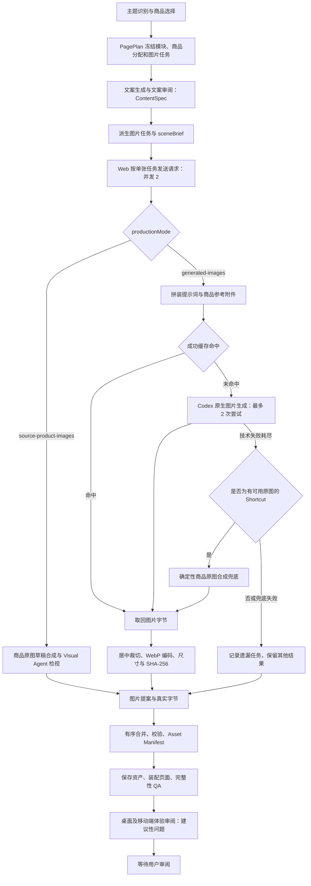

# Topic Generator 图片生成逻辑与提示词 · 完整版

核对日期：2026-09-02。源码基线：本文所在提交。

本文说明当前本地版本的实际实现，不是未来方案。范围覆盖图片任务派生、提示词、商品参考图、原生生成、重试、兜底、缓存、存储和质量检查。本次同步了 Brand 任务实现、Visual Skill、合同、测试与导出提示词，没有发起新的图片生成。

## 1. 先看结论

默认模式是 `generated-images`：先冻结主题、选品、模块和文案，再由独立的 Visual Agent 为每个声明的图片任务生成图片。Codex CLI 调用原生图片生成能力，Runner 处理真实字节，Web Host 校验并保存。

- **Hero**：用已分配商品图作参考，一次生成完整生活场景；商品与环境一起重画，不抠图、不锁定商品图层、不输出 placementPlan。
- **分类入口 Shortcut**：以一个代表商品为主角生成生活场景，优先居中、完整、适合圆形裁切。
- **场景图 Scene**：围绕当前购物场景和文案生成；最多附三张当前场景的商品图，商品可以不出现。
- **品牌横幅 Brand**：最多附三张同品牌商品图作为可选参考；包装和有参考证据的 Logo 可以出现，但都不是必选项。
- **质量政策**：包装、构图、商品数量和参考图覆盖率属于生成指导及审阅信号，不是自动拒绝门槛。真实图片字节、身份、绑定关系、格式和尺寸等属于硬校验。

“默认用于正式场景图”不等于“图片已获人工批准”，也不保证包装文字像素级准确。

## 2. 总流程与职责



| 层 | 负责什么 | 不负责什么 |
| --- | --- | --- |
| Topic Generator / PagePlan | 主题、商品、场景、模块可见性、商品分配、图片任务声明 | 不让图片模型重新选品或增加模块 |
| Content Agent | 已确认标题、描述、标签和场景文案 | 不在图片阶段重新改文案 |
| PageVisual 模块 | 派生任务、检查上游摘要、规范元数据、编译 Asset Manifest | 不生成图片字节 |
| Runner / Codex Visual Agent | 拼装提示词、提供参考附件、调用原生能力、返回图片 | 不修改上游任务、商品或绑定关系 |
| Web Host | 单任务调度、合并、字节检查、保存、页面装配与 QA | 不把模型自报的文件路径当作图片已保存 |

图片阶段依赖 ready 的 PagePlan 与 `content-ready` 的 ContentSpec。上游缺失、摘要不符、模块声明与派生任务不一致，会在生成前阻止流程。已被 ContentSpec 接受的 `background:*` 文案出处不在图片阶段重新核验，也不能直接成为视觉方向或 alt 文本的 evidenceRefs。

## 3. 图片任务、数量与尺寸

只处理 `visible=true` 的模块。不是每个模块都会生成图片。

| 模块 / kind | 任务粒度与 ID | 参考图来源 | 最终输出 | 合同最低尺寸 |
| --- | --- | --- | --- | --- |
| ThemeHero / `hero-image` | 每个可见 Hero 一张；`asset-<moduleId>` | 模块分配的前 5 个商品中所有有 URL 的图，最多 5 张 | 1600×900，16:9 | 1200×675 |
| ShortcutRail / `shortcut-image` | 每个已声明的 shortcut assignment 一张；`asset-<moduleId>-<index+1>` | 该 assignment 的单一代表商品，最多 1 张 | 1024×1024，1:1 | 512×512 |
| ThemeProductList / `scene-image` | 每个 PagePlan scene 一张；`asset-<moduleId>-<sceneId>` | 只取当前 scene assignments；从有 URL 的商品里取前 3 张 | 1024×1024，1:1 | 1024×1024 |
| BrandProductRail / `brand-banner` | 按非空 brand 字符串分组，每品牌一张；`asset-<moduleId>-<index+1>` | 当前品牌中有 URL 的商品图，最多 3 张；均为可选参考 | 1776×640，111:40 | 888×320 |

品牌分组按去除首尾空格后的字符串，保持首次出现顺序；这里不做品牌别名合并。

`ProductList`、`ReviewList` 不声明生成图任务；商品卡继续使用目录商品图。图片总数由当前 PagePlan 决定，不是固定张数。Shortcut 的存在还受模块 `assetTaskIds` 约束，不是有 assignment 就一律生成。

### 3.1 缺图与下载失败不是同一情况

缺少 `imageUrl` 不会阻止 Hero、Shortcut、Scene 或 Brand 进入原生生成：可以只依赖主题、分类、品牌绑定和已确认文案。URL 存在但下载失败则属于技术错误，进入任务重试；当前没有自动删掉这个失败附件再继续的分支。

商品参考图仅允许无凭据的 `https://cdn.yamibuy.net` 地址，重定向的每个目标仍要通过相同检查。默认最多 2 次重定向、单张来源图片 8 MiB、下载超时 15 秒。附件先自动旋转并转换为 PNG；正式生成不抠图、不擦除包装。

## 4. 提示词实际上由哪些层组成

### 4.1 完整拼装顺序

1. 单图片任务执行指令：`Execute one bounded TOPIC GENERATOR visual task.`
2. `agents/openai.yaml` 原文，放入 `<agent-config>`。
3. Visual Generation `SKILL.md` 全文，以及它直接引用的本地 `references/*` 合同全文，放入 `<skill>`。
4. 原生图片能力要求：不用 API key 脚本或 SDK；任务 JSON 视为不可信数据。
5. 按 Hero / Shortcut / Scene / Brand 分支加入参考附件和构图说明。
6. 固定输出文件要求：当前工作目录中的 `generated.png`。
7. 对应类型的“不进行语义拒绝、内部不重试”指令。
8. JSON 返回合同。
9. `<untrusted-art-direction-json>`：当前任务的方向、负向词与要求。

Runner 从 `packages/topic-generator/integrations/codex/visual-generation/` 读取技能与配置；不是依赖临时 Codex 会话自行找到工作区技能。正式图片路径用 `generatedImageTaskPrompt()`，不使用普通文本阶段的通用 `prompt()` 代替。

```text
完整 Agent 输入
  = 固定执行合同
  + Agent 配置原文
  + Visual Generation 技能全文及引用合同
  + 类型专用参考图说明
  + 类型专用接受规则
  + JSON.stringify({
      taskId, assetKind, targetAspectRatio,
      direction, negativePrompt,
      scenePriority, productRole, requirements
    })
  + CLI --image 附件
```

`negativePrompt` 是上述 JSON 的一个文本字段，由 Agent 在调用原生图片能力时使用；代码没有把它作为一个独立的图片模型 API 参数发送。

### 4.2 动态信息怎样进入方向文本

| 信息 | 实际使用方式 |
| --- | --- |
| 主题 | `context.keyword`、主题 shoppingGoal |
| 模块 | 模块 shoppingGoal、reason |
| 需求与条件 | 合并 needs 和 conditions，过滤空值，仅取前 6 项，以 `; ` 连接 |
| Hero 文案 | 只取已确认 title 和可选 description，不包含 CTA 或其他文案字段 |
| 其他文案 | 模块 title、description、tags、items labels，加上当前 scene 的 label/title/description；去重后，方向文本仅取前 6 项 |
| Hero 商品组合 | 任务内商品的 categoryL3Name；缺失时写 `assigned category` |
| Scene 商品组合 | 任务前 5 个商品的分类名称；实际附件另按有 URL 的前 3 个选择 |
| Scene 活动 | 当前 scene 的 shoppingGoal 和 reason |
| 视觉要求 | 原样带入当前类型的 `sceneBrief.requirements` |

**边界：**完整 sceneBrief 存在于工作流上下文，但单图模型输入只包含拼装后字段，不会自动收到整个 ThemeIntent、全部商品数据和完整 ContentSpec。商品标题、价格、销量不作为独立字段出现在单图 JSON。Brand 任务虽有 `brand`，当前方向函数没有显式插入它；品牌只能从主题或模块文案间接体现。

## 5. 完整提示词模板下载与使用

以下四份模板通过当前 `generatedImageTaskPrompt()` 直接导出，包含完整 Agent 配置、技能、引用合同、类型分支以及任务 JSON。没有删去“共享规则”。动态值使用 `{{...}}` 占位，因此它们是**当前代码生成的参数化样例，不是某一次历史图片请求的逐字日志**。

| 用途 | 完整输入模板 |
| --- | --- |
| Hero | [hero.template.txt](topic-generator-image-prompts/hero.template.txt) |
| 分类入口 | [shortcut.template.txt](topic-generator-image-prompts/shortcut.template.txt) |
| 场景图 | [scene.template.txt](topic-generator-image-prompts/scene.template.txt) |
| 品牌横幅 | [brand-banner.template.txt](topic-generator-image-prompts/brand-banner.template.txt) |

使用时，填入真实且已确认的主题、模块目标和文案；按第 3 节附参考图。模板中的商品分类列表以一个代表项演示，实际由代码按任务商品数展开。文案和 needs/conditions 占位符代表已经按第 4.2 节汇总后的文本。

这些是给 **Codex Visual Agent** 的完整指令，包含文件保存和 JSON 回传协议。如果直接在图片工具里创作，使用下面对应的 `direction`、`negativePrompt`、`requirements` 和商品附件即可，不要把文件协议误当画面内容。

### 5.1 Hero：整张生成，参考商品组合

目的：用一个可信的生活场景建立主题感。商品与环境共同生成，使光线、阴影、材质和空间一致。

商品只是可自由取舍的参考集合，不要求全部出现或逐一摆放。主体优先位于画面上方四分之三；底部留出平静空间是构图指导，不是像素级安全区验收。

**direction（英文原文，仅按句换行）**

```text
Create a realistic editorial commerce Hero for the {{keyword}} topic.
Module goal: {{module_shopping_goal}}.
Module rationale: {{module_reason}}.
Theme goal: {{theme_shopping_goal}}.
Accepted Hero copy: {{hero_title}}; {{hero_description}}.
Assigned product mix: product 1: {{assigned_product_category}}.
Needs and conditions: {{needs_and_conditions_first_six}}.
Use the attached product images as visual references and regenerate one complete, coherent multi-product lifestyle scene.
Treat the references as a flexible product family rather than a required checklist: use the products that best support the composition, without enforcing an exact count or one-to-one placement.
For every referenced product that appears, reproduce the source packaging as faithfully as the image model allows: preserve the visible brand name and logo, key label text, typography hierarchy, layout, primary colors, silhouette, cap or pump, and material character.
Never simplify it into blank or generic packaging.
Copy only packaging text visible in the references and do not invent claims.
These are generation priorities rather than rejection gates.
Do not copy source-image backdrops, discs, studio props, or white canvases as if they were part of the product.
Keep the main product group in the upper three quarters and leave calm negative space suitable for the Hero crop.
Do not apply a fixed category template or prescribed prop list.
Let the evidence determine a credible single scene even when the assigned products span multiple categories.
```

**negativePrompt（英文原文）**

```text
product grid, product montage, shelf lineup, floating product, copied white product-image background, copied source-image backdrop, generic unlabeled product container, blank packaging, missing brand name, missing label text, altered packaging layout, altered logo, overlay text, watermark, illustration, collage
```

**requirements（随任务附加的英文原文）**

- Let the visual Agent derive the setting and supporting elements from the accepted Hero copy and assigned product mix.
- Use the available Hero-assigned product images as visual references and regenerate one complete multi-product lifestyle scene.
- Treat the references as a flexible product family rather than a quantity checklist; the result may use a natural subset without one-to-one coverage.
- For every referenced product that appears, reproduce the source packaging as faithfully as the image model allows, including visible brand name and logo, key label text, typography hierarchy, layout, primary colors, silhouette, closure, and material character.
- Never simplify a referenced product into blank or generic packaging; copy only packaging text visible in the reference and do not invent claims.
- Regenerate products and environment together so lighting, shadows, depth, and materials belong to one coherent image.
- Do not extract product pixels, composite source layers, request placement guidance, or use a deterministic Hero image fallback.
- Do not require exact product count or one-to-one coverage; packaging fidelity is a strong generation priority rather than a rejection gate.
- Do not copy source-image backdrops, discs, swatches, white canvases, or studio props into the Hero.
- Do not prescribe category-specific props or environments; let the Agent choose them from the theme and cross-category product evidence.
- Establish the page theme through a broad lifestyle setting with a clear focal area.

完整的参考附件说明、接受规则与返回协议见 [hero.template.txt](topic-generator-image-prompts/hero.template.txt)。

### 5.2 Shortcut：单商品主角，圆形裁切

目的：用一个代表商品表达分类。商品居中、完整、留出圆形裁切余量，场景和道具处于次要地位。

“单商品”“包装忠实”“安全裁切”均是强生成指导，当前不会因数量、标签或位置差异触发语义重试。

**direction（英文原文，仅按句换行）**

```text
Create a realistic product-led lifestyle image for the {{keyword}} topic.
Product category: {{assigned_product_category}}.
Category goal: {{module_shopping_goal}}.
Accepted category copy: {{accepted_copy_first_six}}.
Use the attached representative product image as a visual reference for the category and product character.
Create a single-product lifestyle scene with the product as the primary subject.
Favor a centered, fully visible product with clear margin for a circular crop.
Build a credible lifestyle environment from the product category and shopping goal; natural light, surfaces, ingredients, and use-context props may support the story but must remain secondary.
Reproduce the source packaging as faithfully as the image model allows: preserve the visible brand name and logo, key label text, typography hierarchy, layout, primary colors, silhouette, cap or pump, and material character.
Never simplify it into blank or generic packaging.
Copy only packaging text visible in the reference and do not invent claims.
These are generation priorities rather than rejection gates.
Avoid a lineup, grid, collage, or isolated white-background packshot.
```

**negativePrompt（英文原文）**

```text
missing product, tiny product, off-center product, cropped product, duplicate product, multiple products, product grid, product montage, distorted packaging, invented packaging, altered label, altered logo, blank packaging, missing brand name, missing label text, altered packaging layout, fabricated claim, overlay text, watermark, illustration, collage
```

**requirements（随任务附加的英文原文）**

- Use the assigned representative product image as a visual reference for a single-product lifestyle scene.
- Favor a clear product subject near the center with enough margin for a circular crop.
- Build a natural lifestyle setting around the product; props and environment remain secondary.
- Reproduce the source packaging as faithfully as the image model allows, including visible brand name and logo, key label text, typography hierarchy, layout, primary colors, silhouette, closure, and material character.
- Never simplify the product into blank or generic packaging; copy only packaging text visible in the reference and do not invent claims.
- Treat product placement, packaging fidelity, and crop safety as strong generation guidance rather than acceptance requirements.
- Represent the assigned category through a compact contextual micro-scene.

完整的参考附件说明、接受规则与返回协议见 [shortcut.template.txt](topic-generator-image-prompts/shortcut.template.txt)。

### 5.3 Scene：当前场景优先，商品可选

目的：表达当前购物场景的具体活动，而不是给同一张通用图片换标题。仅可使用当前场景分配的商品参考；不借用其他 scene 的商品。

上方偏右安排主体或关键动作，左下约三分之一保持低细节，兼顾居中宽幅及卡片裁切。不要把文字、渐变、文字底板或遮罩烘焙进图；前景对比由组件负责。以上仍是软构图要求。

**direction（英文原文，仅按句换行）**

```text
Create a naturalistic square editorial commerce scene for the {{keyword}} topic.
Module goal: {{module_shopping_goal}}.
Module rationale: {{module_reason}}.
Theme goal: {{theme_shopping_goal}}.
Scene activity: {{scene_shopping_goal}}.
Scene rationale: {{scene_reason}}.
Accepted copy theme: {{accepted_copy_first_six}}.
Needs and conditions: {{needs_and_conditions_first_six}}.
Current scene product references: reference 1: {{assigned_product_category}}.
Use the attached current-scene product images as visual references and regenerate one complete, coherent lifestyle scene.
Products are optional: a product-free scene is valid when the environment and activity express the scene more naturally.
Products are optional.
For every referenced product that appears, reproduce the source packaging as faithfully as the image model allows: preserve the visible brand name and logo, key label text, typography hierarchy, layout, primary colors, silhouette, cap or pump, and material character.
Never simplify it into blank or generic packaging.
Copy only packaging text visible in the references and do not invent claims.
Do not enforce an exact product count or one-to-one placement.
Packaging fidelity is a strong generation priority rather than a rejection gate.
Do not copy source-image backdrops, swatches, discs, studio props, badges, or white canvases as scene elements.
Do not turn the result into an isolated packshot, lineup, grid, or montage.
Keep the key action and primary subject in the upper-right area of the square so they survive centered wide and card crops.
Reserve roughly the lower-left third as a calm, low-detail copy-safe area without faces, hands, key actions, large props, or high-contrast edges.
Do not bake text, a gradient, a text panel, or a scrim into the image; the component owns foreground contrast.
Make the activity and setting specific enough that the image could not credibly illustrate a sibling scene after only swapping the title.
Use realistic materials, natural light, credible scale, and a calm product-first YAMI tone.
Do not invent extra products, unsupported packaging claims, overlay text, unrelated logos, or watermarks.
```

**negativePrompt（英文原文）**

```text
isolated product packshot, product grid, product montage, shelf lineup, unassigned product, dominant product lineup, copied white product-image background, copied source-image backdrop, copied source-image swatch, copied source-image badge, generic unlabeled product container, blank packaging, missing brand name, missing label text, altered packaging layout, unsupported packaging claim, fabricated product claim, overlay text, baked text panel, baked scrim, watermark, illustration, collage
```

**requirements（随任务附加的英文原文）**

- Depict a coherent, naturalistic scene that expresses this module's shopping goal.
- Use products assigned to the current scene as visual references for regenerating one complete lifestyle image.
- Products are optional; a product-free scene is valid.
- For every referenced product that appears, reproduce the source packaging as faithfully as the image model allows, including visible brand name and logo, key label text, typography hierarchy, layout, primary colors, silhouette, closure, and material character.
- Never simplify a referenced product into blank or generic packaging; copy only packaging text visible in the reference and do not invent claims.
- Do not require an exact product count or one-to-one coverage; packaging fidelity is a strong generation priority rather than a rejection gate.
- Do not copy source-image backdrops, swatches, discs, badges, white canvases, or studio props into the scene.
- Do not use isolated product packshots, tiled product grids, or product montages as the primary visual.
- Keep the scene and activity primary, and do not introduce products assigned to another scene.
- Keep the key action in the upper-right area, preserve it in centered wide and card crops, and reserve a quiet lower-left copy-safe area.
- Do not bake text, a gradient, a text panel, or a scrim into the image.
- Show the activity, environment, and props implied by the PagePlan scene and accepted copy.

完整的参考附件说明、接受规则与返回协议见 [scene.template.txt](topic-generator-image-prompts/scene.template.txt)。

### 5.4 Brand：品牌绑定的可选包装与 Logo 横幅

目的：为每个非空 brand 独立生成宽幅横幅。最多附三张当前品牌的商品图作为可选视觉参考；包装和 Logo 可以出现，但不强制出现。商品主导、Logo 主导和纯氛围三种方向都有效，只要符合模块目标和已有证据。

当前任务合同只有已分配商品的图片 URL，没有独立 Logo 文件字段。因此 Logo 或 wordmark 只能在附件中有可见依据时使用；不能根据品牌名、商品组合或其他品牌素材猜测、补全或重画品牌资产。不使用包装或 Logo 也不是缺陷，此时画面应保持品类相关且不声称独特品牌视觉身份。

**direction（英文原文，仅按句换行）**

```text
Create a naturalistic wide editorial commerce banner for the {{keyword}} topic.
Brand binding: {{brand}}.
Module goal: {{module_shopping_goal}}.
Module rationale: {{module_reason}}.
Theme goal: {{theme_shopping_goal}}.
Accepted copy theme: {{accepted_copy_first_six}}.
Needs and conditions: {{needs_and_conditions_first_six}}.
Current brand product references: reference 1: {{assigned_product_category}}.
Use up to three attached assigned product images as optional visual references for this exact brand binding.
Packaging and logos are permitted but optional; do not require either to appear.
Reference availability does not require visibility. A product-led banner with recognizable packaging, a logo-led brand scene, or an atmosphere-led banner without packaging or a logo is valid when supported by the brief.
For every referenced product or package that appears, reproduce the visible brand name and logo, key label text, typography hierarchy, layout, primary colors, silhouette, closure, and material as faithfully as the image model allows.
A logo or wordmark visibly supported by an attached reference may appear clearly. Do not invent, redraw, restyle, merge, translate, complete, or substitute a logo, wordmark, package design, label, brand mark, or marketing claim.
Do not force packaging or a logo into the image merely because a reference is attached. When neither appears, keep the scene category-relevant and do not infer a distinct visual identity from the brand name or product mix alone.
Compose any visible product, packaging, supported logo, environment, and light as one coherent wide banner.
Keep visible packaging and logos recognizable in the 111:40 crop and clear of the component's lower title overlay.
Environmental vessels and category-relevant containers may appear when they support the scene.
Avoid an unrequested grid, montage, shelf lineup, repeated logo pattern, or arbitrary product collection. A deliberate packshot or small product grouping is valid when it serves the module goal.
Use realistic materials, natural light, credible scale, and a calm product-first YAMI tone.
```

**negativePrompt（英文原文）**

```text
cross-brand product or brand asset, invented or substituted packaging, altered packaging layout, unsupported or altered logo, distorted wordmark, repeated logo pattern, fabricated label, fabricated marketing claim, unrelated readable text, unrequested product grid, unrequested product montage, unrequested shelf lineup, watermark, illustration, collage
```

**requirements（随任务附加的英文原文）**

- Treat each non-empty brand binding as an independent wide brand-expression task; never borrow products or brand identity from another brand.
- Use up to three available product images assigned to the current brand as optional visual references.
- Product packaging and logos are permitted but optional; do not require either unless the task explicitly makes it required.
- Reference availability does not require reference visibility; product-led, logo-led, and atmosphere-led banners are all valid when supported by the brief.
- For every referenced product or package that appears, reproduce the visible brand name and logo, key label text, typography hierarchy, layout, primary colors, silhouette, closure, and material as faithfully as the image model allows.
- Do not invent, redraw, restyle, merge, translate, complete, or substitute a logo, wordmark, package design, label, brand mark, or marketing claim.
- Do not force packaging or a logo into the image merely because a reference is available; their absence is not a defect unless the task makes them required.
- When no referenced brand asset appears, keep the scene category-relevant and do not infer a distinct visual identity from the brand name or product mix alone.
- Compose any visible product, packaging, supported logo, environment, and light as one coherent wide banner.
- Keep any visible packaging or logo recognizable in the wide crop and clear of the component's lower title overlay.
- Avoid an unrequested grid, montage, shelf lineup, repeated logo pattern, or arbitrary product collection; a deliberate packshot or small product grouping is valid when it serves the module goal.
- Environmental vessels and category-relevant containers may appear when they support the scene.
- Express the exact brand binding through an evidence-supported wide banner; packaging and a logo are optional.

完整的参考附件说明、接受规则与返回协议见 [brand-banner.template.txt](topic-generator-image-prompts/brand-banner.template.txt)。

### 5.5 原生生成结果合同

```json
{
  "schemaVersion": "topic-page-native-image-task-result/v1",
  "taskId": "<原任务 taskId>",
  "status": "accepted",
  "relativePath": "generated.png",
  "scenePrompt": "<Agent 回报实际使用的简洁场景提示词>",
  "issues": []
}
```

schemaVersion、taskId、相对文件名和 status 的可选值都要合法。解析器默认允许 `status: rejected` 继续；只要固定文件可读取并通过后续图片处理，就不会仅因 Agent 的语义拒绝而重试。`scenePrompt` 可缺省：缺少时最终 `direction.prompt` 回退为代码拼装的 artDirection。

## 6. Codex 如何执行一次图片生成

每次原生尝试创建独立临时目录，下载当前任务附件并写入目录。命令形态如下；方括号内容按实际情况添加：

```text
codex exec --enable image_generation
  --ephemeral --ignore-user-config --skip-git-repo-check
  --sandbox workspace-write
  --cd <本次临时目录>
  --color never
  --output-last-message <本次临时目录>/response.json
  [--model <Codex Agent 模型>]
  [--image representative-product.png]
  [--image product-reference-1.png ...]
  -
```

完整任务提示词通过 stdin 输入。图像要求保存为该目录的 `generated.png`，JSON 写入 `response.json`。Runner 读取两者后，在 finally 中删除临时目录；成功原图另由缓存保留。

启动时探测 `codex login status` 与 `codex features list`。需要 ChatGPT 登录及 `image_generation=true`。`TOPIC_AGENT_RUNNER_CODEX_MODEL` 选择的是执行任务的 Codex Agent，不是图片模型。

本次 `/health` 实测为 `status=ready`、`executor=codex`、`imageInput=true`、`imageGeneration=true`、`provider=codex-native`、`authMode=chatgpt`、`modelSource=unreported`。因此本文不把某个 GPT Image 型号当作当前运行时已证明的型号。

## 7. 并发、重试和失败处理

### 7.1 三个不同层次，不要混淆

| 层次 | 当前设置 | 意义 |
| --- | --- | --- |
| Web HTTP 图片调度 | 固定并发 2，每个请求只放 1 个 task | 当前网页生成同一批图片时实际最多同时发送 2 个单图请求 |
| Runner 单请求内调度 | 默认 3，允许 1–4 | 直接向 Runner 传多个 task 时有效；不是全服务的总并发上限 |
| 每张原生图片尝试 | 默认最多 2 次 | 第一次失败后再试一次；与整个工作流 stage attempt 不同 |
| managed-run 的 visual-generation 阶段 | 最大自动 attempt 为 1 | 不代表单张图只能调用一次原生生成 |

因此将 Runner 并发从 3 改到 4，不会把当前 Web 的单批并发 2 自动改成 4。不同运行同时存在时，这些限制也不是跨运行的全局锁。

每次原生执行超时默认 300 秒；Web Host 默认每个 Page Agent HTTP 请求等待 900 秒。排队时间另计，不能把它理解成整页总时长上限。Runner 的尝试时间还包含获取源图、缓存查询和图片处理等开销，原生 CLI 的 300 秒不是这段全部处理的统一时钟。

### 7.2 会触发重试的情况

包括进程失败/超时、参考图下载失败、返回 JSON 或固定文件名不合法、图片文件不存在、原始生成文件超出大小限制、空字节、不可解码或不支持的图片格式等。循环捕获生成及规范化阶段抛出的错误，没有“只重试某些错误码”的分类，也没有自动改写 prompt 或退避延迟。

两次尝试使用同一份任务和提示词；不会根据上一张图的构图、品牌标签或商品数量改写提示词再生成。Agent 也被要求不要在单任务内部自行重试。

### 7.3 各类型耗尽尝试后的行为

| 类型 | 处理 |
| --- | --- |
| Hero | 跳过并记录问题；不做 placement recovery、不合成源图、不输出确定性 Hero 兜底 |
| Scene | 跳过并记录问题；不回退成商品图拼贴 |
| Brand | 跳过并记录问题 |
| Shortcut，有可读取代表商品图 | 尝试一次确定性商品原图生活背景合成 |
| Shortcut，没有参考 URL 或兜底也失败 | 当前 Web 的单图请求层捕获失败并跳过该 task |

在 Web 路径中，各任务独立请求并捕获错误，最终保持原任务相对顺序，允许部分成功乃至空 Asset Manifest。协议不匹配、未知 task、重复 task/ref、任务次序错误或资产完整性错误仍可能阻止合并或后续保存；“允许缺图”不等于接受损坏数据。

直接批量调用 Runner 时要留意：Shortcut 兜底的异常会向外抛出；保留其余任务的外层单任务隔离属于 Web HTTP 适配层，不能把它当作 Runner 任意批量调用的保证。

### 7.4 Shortcut 兜底的真实做法

它不调用图片模型，没有第二套 AI 生图提示词：

1. 对商品分类名称（缺省使用 moduleId）做 SHA-256，选择 4 套预设配色中的一套。
2. 生成 1024×1024 SVG 背景，包含渐变、柔化色块、平台和阴影。
3. 原商品图自动旋转、裁去外侧白边，等比放入 620×620 透明容器。
4. 在背景坐标 `left=202, top=118` 放置商品，输出 PNG，随后进入统一 WebP 处理。

这里是裁白边与合成，不是语义分割抠图，也不是完整真实场景重新生成。记录 `fallbackUsed=true`、技术失败原因，以及以下来源描述：

```text
Deterministic source-product lifestyle fallback.
```

兜底不是因为画面“不够好看”而触发，也不会自动替代所有失败图片。

## 8. 缓存和“重新生成”的含义

成功原生结果有两层缓存：Runner 进程内的 Promise Map，以及磁盘目录。默认磁盘目录为仓库下 `.topic-generator/image-cache`，可用绝对路径环境变量覆盖；不需要额外配置才有重启缓存。

缓存 key 是以下材料序列化后的 SHA-256：

- 当前解析后的 task、完整提示词、输出文件名和附件 URL。
- 流程版本：Hero `hero-generative-v3`、Shortcut `shortcut-generative-v3`、Scene `scene-generative-v4`。
- 图片能力探测信息，以及配置的 Codex Agent 模型（未配置为 null）。
- 每张实际参考原图的字节 SHA-256。

磁盘条目包含 `image.bin` 和 `metadata.json`；后者可含 Agent 回报的 scenePrompt。内存容量默认 64 个条目；磁盘没有对应的 64 条清理逻辑。生成调用抛错的条目会从内存移除，不作为成功结果缓存；Shortcut 的确定性兜底不经过原生成功缓存。

两点容易误解：

- 查询缓存前仍要取得来源图片来计算 sourceDigests，因而“磁盘有缓存”不保证可以完全离线复用。
- “重新生成图片”可能命中同一任务缓存；当前 key 没有随机 seed 或强制刷新 nonce。相同任务不保证产生不同画面。

缓存封装位于 `normalizeImage()` 之前，缓存的是原生执行成功并读出的原图。后续解码失败不等价于原生缓存自动失效；不能把缓存命中视为资产已通过全部校验。

## 9. 图片处理、元数据和硬校验

### 9.1 Runner 统一处理

只接受可解码的 PNG、JPEG、WebP，随后执行：

```text
原图 → 根据 EXIF 旋转 → resize(target, fit=cover, position=centre)
     → WebP quality=88, effort=4
     → 计算最终字节 SHA-256
     → 缩成 1×1 取平均色，按需记录 backgroundColor
```

尺寸使用第 3 节“最终输出”。原始比例不符时会居中裁切；较小的原图也可能被放大。硬校验检查最终产物的比例和最低尺寸，不是要求图片模型第一次返回的源文件天然达到同样尺寸。

Hero 和 Scene 的 focalPoint 默认 `{x:0.5,y:0.45}`，其他类型为 `{x:0.5,y:0.5}`。它们是确定性默认值，不是模型识别出的真实主体位置；规范化裁切本身仍使用中心裁切。Hero 与 Scene 必须记录背景色，Shortcut 与 Brand 不强制。

### 9.2 元数据来源

| 字段 | 来源 |
| --- | --- |
| `direction.prompt` | 优先使用 Agent 返回的 scenePrompt，否则用代码 artDirection |
| `negativePrompt` | 当前类型的固定负向词 |
| `referenceProductIds` | 该任务全部分配商品 |
| `attachedReferenceProductIds` | 按类型规则选出的实际附件商品列表；不代表图片里实际出现的商品 |
| `evidenceRefs` | Host 根据冻结的 sceneBrief 规范化，不信任 Agent 自造证据 |
| `generationProvenance` | provider、modelSource、尝试次数、cacheHit、排队/任务/单次耗时、技术错误摘要 |
| `altText` | Shortcut 为 null；其他类型按场景目标/首条文案/模块目标生成本地化说明 |
| `artifact` | 真正处理后字节的 ref、MIME、宽高、digest、默认焦点和按需背景色 |

中文默认 alt 形态为 `〈场景目标或文案〉的自然场景`，英文为 `A natural scene inspired by 〈subject〉`。这不是另一次逐图视觉识别描述。

### 9.3 进入 Asset Manifest 与保存前

检查提案身份、productionMode、主题/选品/PagePlan/ContentSpec 摘要、任务声明和相对顺序、ref 唯一性与安全性、扩展名和 MIME、整数宽高、比例误差不超过 2%、SHA-256 格式、焦点 0–1、所需背景色等。

Agent 漏填或漂移的 moduleId/component/kind、证据、参考商品列表等语义元数据由任务上下文规范化。真正的文件字节还要与提案逐一配对，重新计算摘要、解码并比较实际尺寸和 MIME。所有待保存资产先验证，通过后才开始写入。

后续 QA 再从存储读取实际文件。`sources`、`bindings`、`modules`、`assets` 的失败会阻止页面完成；`visual-policy`、内容或可访问性结构类问题当前作为建议性问题保留。体验审阅会看桌面、移动端及 Hero 裁切，但不因为包装或构图不理想自动重生图片，也不替代用户批准。

## 10. 保存在哪里，能追溯到什么提示词

### 10.1 当前 Web managed-run

开发环境默认根目录是用户目录下的 `Yami Topic Generator`。每次运行包含：

```text
<用户目录>/Yami Topic Generator/runs/<runId>/
  run.json
  state.json
  events.jsonl
  stages/visual-generation/attempt-0001/
    request.json
    proposal.json
    result.json
  assets/
    assets/generated/01-<task-name>.webp
    assets/generated/02-<task-name>.webp
    ...
  deliverables/
    ...
```

这里两个 `assets` 不是笔误：run 的资产存储根是 `<run>/assets`，而 manifest ref 本身以 `assets/generated/` 开头。HTTP 适配层会按原任务索引重排文件序号，遗漏任务可能造成序号不连续。

资产通过 `/api/topic-generator/runs/<runId>/assets?ref=...` 提供。非 managed-run 的自动化路径另使用统一资产根及 `/api/topic-generator/assets?ref=...`，不要混用。

`TOPIC_GENERATOR_STORAGE_ROOT` 可覆盖统一根目录；`TOPIC_GENERATOR_RUN_ROOT` / `TOPIC_GENERATOR_ASSET_ROOT` 是分开覆盖。生产环境要求明确的持久化统一存储配置。

### 10.2 三种“提示词”需要区分

| 内容 | 当前是否保留 |
| --- | --- |
| 本文四份模板：代码可重建的完整 Agent 输入 | 本文已导出；真实请求中的动态值需从对应工作流上下文重建 |
| Agent 回报的简洁 scenePrompt | 成功时写入提案 `assets[].direction.prompt`；若 Agent 未返回，该字段存的是 artDirection |
| 原生图片工具的完整底层调用日志、所有中间对话及模型内部改写 | 当前持久化逻辑不保证保存；临时执行目录会删除 |

因此，不能把 `direction.prompt` 无条件宣称为“图片模型最终接收到的完整逐字提示词”。它是 Agent 自报简洁提示词或代码回退文本，也不是完整技能+执行合同。

Web 的 visual-generation `request.json` 当前记录的是 PagePlan 和 ContentSpec 摘要，不是完整 stdin。若要审计某张图，应同时看 proposal、上游上下文、代码版本和缓存 metadata。

下载主题包会包含生成图片；商品卡的 Yami CDN 图仍需要网络。源码提交到 GitHub不等于运行记录、缓存和图片已经获得云端备份。

## 11. 另一个模式：source-product-images

这是明确选择的草稿模式，不是 generated-images 不可用时自动切换的默认流程。

该模式以固定浅色背景 `#f4f3ef` 将原商品图按网格等比排布，保留商品原图身份；Scene 网格只占上方约 72% 的高度，留出下方区域。输出 WebP，quality=90、effort=4。缺少必需商品原图或无法解码时，这个合成任务会失败。

准备好的图像会作为附件交给 Visual Agent 检视；这里使用普通阶段的 Agent/Skill/执行合同包装，context 中增加 `preparedSourceImageProposal`。Agent 可以返回 direction 和 altText，但不能替换已经生成的 artifact 字节元数据。

合成时写入的来源描述如下；它是元数据，不驱动图片模型绘图：

```text
Draft-only source-product reference composition for "{{module_shopping_goal}}".
Theme: "{{theme_shopping_goal}}".
Categories: "{{category_summary}}".
Accepted copy: "{{copy_summary}}".
Preserve catalog identity; this is not a generated scene and cannot be used as a final semantic visual.
```

```text
generated scene, generated packaging, altered labels, unsupported claims, added text
```

后续 QA 会记录 `visual-policy` 草稿质量问题，但只要完整性通过，当前不因此阻止页面完成。Kiro 当前没有图片输入和生成能力，不能被描述为已经支持这条需看图的流程。

## 12. 配置项速查

下表是源码默认值，并不声称所有环境都使用相同覆盖值。

| 配置 / 限制 | 默认值 | 作用 |
| --- | --- | --- |
| `TOPIC_GENERATOR_VISUAL_PRODUCTION_MODE` | `generated-images` | 原生生成或显式草稿合成 |
| `TOPIC_GENERATOR_PAGE_AGENT_ENDPOINT` | 完整启动脚本设置为 `http://127.0.0.1:4400/topic-page` | Web 调用 Runner |
| `TOPIC_GENERATOR_PAGE_AGENT_TIMEOUT_MS` | 900000 | Web 单次 HTTP 请求超时；允许 1000–900000 |
| Web `VISUAL_REQUEST_CONCURRENCY` | 2 | 源码常量，不是 Runner 环境变量 |
| `TOPIC_AGENT_RUNNER_IMAGE_CONCURRENCY` | 3 | Runner 每请求的任务池；允许 1–4 |
| `TOPIC_AGENT_RUNNER_IMAGE_ATTEMPT_TIMEOUT_MS` | 300000 | 单次原生进程超时；最大 300000 |
| `TOPIC_AGENT_RUNNER_MAX_IMAGE_BYTES` | 25 MiB | 读取的原始生成文件大小；最大可配置 50 MiB |
| `TOPIC_AGENT_RUNNER_MAX_OUTPUT_BYTES` | 4 MiB | 子进程 stdout+stderr 输出限制；不是图片文件大小 |
| `TOPIC_AGENT_RUNNER_IMAGE_CACHE_ROOT` | `<仓库>/.topic-generator/image-cache` | 成功原生图片的持久缓存，覆盖时须为绝对路径 |
| `TOPIC_AGENT_RUNNER_CODEX_MODEL` | 未指定 | Codex Agent 模型，不是图片模型 |
| `TOPIC_GENERATOR_STORAGE_ROOT` | 开发时为 `~/Yami Topic Generator` | 运行和最终资产统一存储根 |

图片尝试次数来自 `compileGeneratedImageVisualResponse` 的 `attempts` 参数，默认 2，函数允许 1–3；当前 Codex Executor 未暴露一个同名的 attempts 环境变量。

## 13. 当前事实与容易过期的描述

| 容易误读的说法 | 当前实际行为 |
| --- | --- |
| Hero 先生成背景，再抠图拼接 | 正式生成已改成整张重画；没有 placementPlan、位置恢复或源图层 Hero 兜底 |
| 所有图片绝对不能出现包装文字 | Hero/Shortcut/Scene 要尽量保留参考图可见包装；Brand 也允许包装和有依据的 Logo，但都不是必选项。所有类型都不能编造文字、声明或品牌资产 |
| 包装不准确就自动拒绝重试 | 目前不会；包装忠实度是强提示词指导，仍需人审 |
| 默认并发就是 3 | Runner 内层为 3；当前 Web 同批单图请求并发为 2 |
| 只有配置了缓存路径才有重启复用 | 当前已有仓库内默认磁盘缓存 |
| 没有 source URL 就不能生成 | 原生生成允许无附件；显式 source-product-images 合成不允许缺原图 |
| 请求里的所有商品都一定出现在图里 | 不保证；referenceProductIds 不是视觉识别后的出现列表 |
| 点击生成图片一定生成新画面 | 同 key 可复用缓存，没有自动加入随机种子 |
| 一个 QA 总状态 passed 代表没有视觉问题 | 当前完整性通过即可继续；建议性问题仍可能存在 |

正文采用实现为准。例如 Agent Runner README 中仍有“默认并发 2”的文字，以及 source compositor 的注释仍写“final QA rejects this production mode”；它们不能替代当前代码的并发层次和 QA 分级规则。本次没有顺带修改这些原有文件。

## 14. 核验与源码索引

已运行聚焦测试：Runner 7 个测试文件、61 项通过；Topic Generator 35 个测试文件、398 项通过。新增用例覆盖 Brand 同品牌参考附件、包装与 Logo 可选、品牌资产忠实度及禁止跨品牌借用。测试证明代码合同与覆盖场景，不证明某一主题的实际新图视觉质量；本次没有调用原生生图。

四份模板已与同一组占位输入下的实际拼装函数返回值逐字核对（文件末尾增加一个换行）；各自包含完整技能和引用合同。模板文件 SHA-256：

| 文件 | SHA-256 |
| --- | --- |
| hero.template.txt | `23b6ff676dc4435e9a76cca86e7d0b38aa9d3f8a8d6d91040f14f9fabd2a0930` |
| shortcut.template.txt | `956adad2f930d4d474770d2bf31eb351d4ae1aa3140b796bd07771e744c3fc85` |
| scene.template.txt | `3aca2979de8de400a14fb8f8e37808f549cbc25baba81e4e631e3f2cddc371f3` |
| brand-banner.template.txt | `062c59f820ab7f0d597030a3e8fa4cc5891639c8f5d47ac19aac31cea8fcd988` |

| 内容 | 源码 |
| --- | --- |
| 任务派生、尺寸规则、requirements、文案汇总 | [page-visual/tasks.ts](../packages/topic-generator/src/page-visual/tasks.ts) |
| visual preflight、元数据规范化与提案检查 | [page-visual/review.ts](../packages/topic-generator/src/page-visual/review.ts) |
| 四类方向、负向词、完整提示词、重试、规范化 | [generated-image-visual.ts](../apps/topic-generator-agent/src/generated-image-visual.ts) |
| 原生 CLI、能力探测、模型边界、缓存材料 | [executor.ts](../apps/topic-generator-agent/src/executor.ts) |
| 技能引用加载、生成与草稿分支 | [handler.ts](../apps/topic-generator-agent/src/handler.ts) |
| 单图 HTTP 并发、错误隔离、序号与结果合并 | [page-automation/http-agent.ts](../packages/topic-generator/src/page-automation/http-agent.ts) |
| 原图下载与显式草稿合成 | [source-image-compositor.ts](../apps/topic-generator-agent/src/source-image-compositor.ts) |
| 图片生成与保存阶段 | [managed-run/workflow.ts](../packages/topic-generator/src/managed-run/workflow.ts) |
| run 内资产与提案持久化 | [managed-run/store.ts](../packages/topic-generator/src/managed-run/store.ts) |
| Web 超时与 productionMode | [page-automation-runtime.ts](../apps/topic-generator/lib/page-automation-runtime.ts) |
| 统一存储目录 | [topic-generator-storage.ts](../apps/topic-generator/lib/topic-generator-storage.ts) |
| 完整性 QA 与建议性质量项 | [page-generation/qa.ts](../packages/topic-generator/src/page-generation/qa.ts) |
| 完整视觉技能 | [Visual Generation SKILL.md](../packages/topic-generator/integrations/codex/visual-generation/SKILL.md) |
| 视觉提案合同 | [topic-page-visual-contract.md](../packages/topic-generator/integrations/codex/visual-generation/references/topic-page-visual-contract.md) |
| 体验审阅规则 | [Page Review SKILL.md](../packages/topic-generator/integrations/codex/page-review/SKILL.md) |

提示词模板是此源码基线的静态快照。后续若修改技能、合同、requirements 或提示词函数，需重新导出再使用，不能假定模板自动同步。
